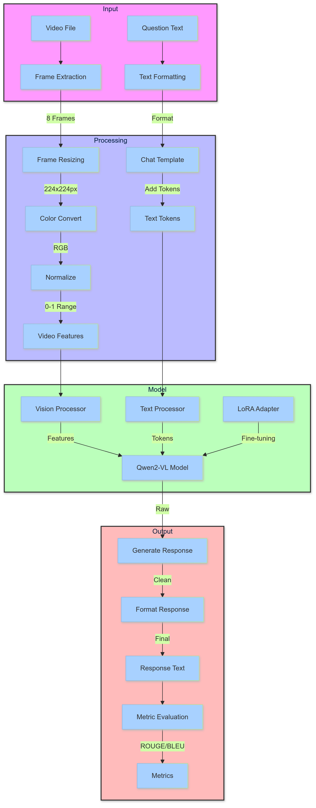

# Qwen2-VL Video Understanding System

## Overview
This system uses a fine-tuned Qwen2-VL model for video understanding and description generation. It processes video inputs frame by frame and generates natural language descriptions of the video content.

## Architecture

### Model Architecture
- Base Model: Qwen2-VL-7B-Instruct (7B parameter multimodal model)
- Fine-tuning Method: LoRA (Low-Rank Adaptation)
- Vision Processing: Uses frozen vision tower
- Training Data: WebVid formatted dataset

### Training Configuration
```yaml
model_name_or_path: Qwen/Qwen2-VL-7B-Instruct
template: qwen2_vl
trust_remote_code: true
stage: sft
do_train: true
finetuning_type: lora
freeze_vision_tower: true

# LoRA Configuration
lora_rank: 64
lora_alpha: 128
lora_dropout: 0.05
lora_target: q_proj,v_proj

# Training Parameters
per_device_train_batch_size: 4
gradient_accumulation_steps: 4
learning_rate: 0.0002
num_train_epochs: 3
warmup_ratio: 0.1
bf16: true
```

## System Flow

1. **Video Input Processing**
   - Loads video using OpenCV
   - Extracts 8 frames at equally spaced intervals
   - Resizes frames to 224x224 pixels
   - Normalizes pixel values to [0,1] range
   - Converts BGR to RGB color format

2. **Model Processing**
   - Video frames are processed through the vision tower
   - Text input is tokenized and formatted using Qwen's chat template
   - Video features and text tokens are combined
   - LoRA adapter modifies key model weights for the task

3. **Response Generation**
   - Model generates text description using beam search
   - Responses are cleaned and formatted
   - Special tokens are removed
   - Metrics are calculated (ROUGE, BLEU, METEOR)

## Implementation Details

### Frame Extraction (`extract_frames` method)
```python
def extract_frames(self, video_path: str, num_frames: int = 8):
    """
    Extracts evenly spaced frames from video
    - Opens video with OpenCV
    - Samples num_frames frames
    - Processes each frame (resize, color convert, normalize)
    - Returns stacked numpy array of frames
    """
```

### Video Processing (`process_video` method)
```python
def process_video(self, video_path: str, question: str):
    """
    Prepares video and text for model input
    - Extracts frames
    - Formats question with chat template
    - Processes through Qwen processor
    - Returns model-ready tensors
    """
```

### Response Generation (`generate_response` method)
```python
def generate_response(self, question: str, video_path: str):
    """
    Generates response for video-question pair
    - Processes video and question
    - Runs model generation
    - Cleans and formats response
    - Returns natural language description
    """
```

## Current Issues

1. **Video Token Alignment**
   - Error: "Video features and video tokens do not match: tokens: 0, features 256"
   - Model expects alignment between video pad tokens and frame features
   - Current mismatch between processed features and expected token count

2. **Generation Quality**
   - Some responses are empty or repetitive
   - Need to improve prompt engineering and generation parameters
   - Potential issues with model fine-tuning setup

## Troubleshooting Steps

1. **Video Feature Processing**
   - Verify frame extraction dimensions
   - Check feature extraction pipeline
   - Ensure proper normalization

2. **Token Alignment**
   - Adjust video_pad token count
   - Verify processor configuration
   - Check model's expected feature dimensions

3. **Generation Parameters**
   - Tune beam search settings
   - Adjust temperature and top_p
   - Optimize max token length

## Next Steps

1. **Token Alignment Fix**
   - Implement correct video token generation
   - Match features to expected model dimensions
   - Add proper padding handling

2. **Model Fine-tuning Improvements**
   - Review LoRA configuration
   - Adjust training parameters
   - Consider different vision tower settings

3. **Generation Quality**
   - Improve prompt engineering
   - Optimize generation parameters
   - Add better response cleaning

## Dependencies
- PyTorch
- Transformers
- OpenCV
- NumPy
- PEFT (Parameter-Efficient Fine-Tuning)
- Evaluate

## Usage
### Training
```bash
llamafactory-cli train ./configs/train_config.yaml
```
### Inferenece
```bash
python evaluate_model.py \
    --base-model "Qwen/Qwen2-VL-7B-Instruct" \
    --adapter-path "/path/to/lora/adapter" \
    --test-data "/path/to/test.json" \
    --video-dir "/path/to/videos" \
    --output-dir "/path/to/results" \
    --num-samples 10
```
## Flow diagram
